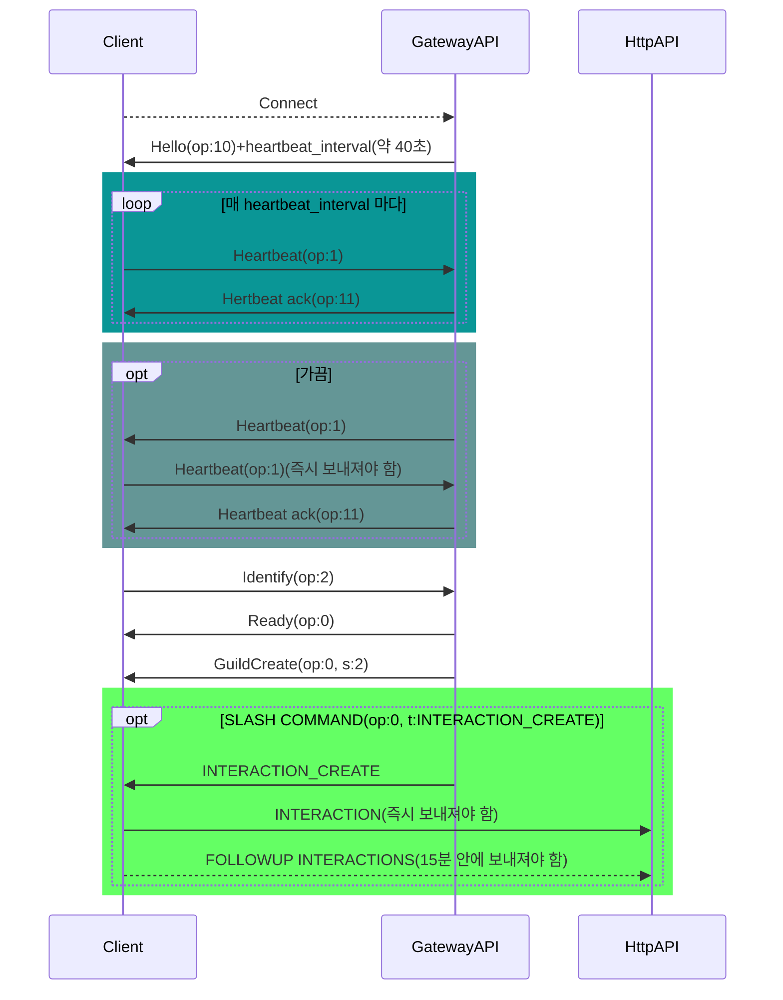

# **디스코드 API를 활용한 학습도움 봇 만들기**
30725 조다니엘

---

# 사용한 라이브러리
### asyncio
여러개의 명령을 동시에 처리하기 위해
### websockets
Websocket(Discord GATEWAY API에서 사용)을 사용하기 위해
### json
Dict 자료형 $\leftrightarrow$ JSON 문자열 변환을 간단하게 하기 위해

---

# 디스코드 API의 구성

## Discord HTTP API
 - 봇의 명령어 등록 등의 역할 수행(자료가 오고가고 하지는 않음)

## Discord GATEWAY API
 - 봇이 정상적으로 동작함 알림
 - 데이터 받기(자료가 오고감)

---

# tmp

